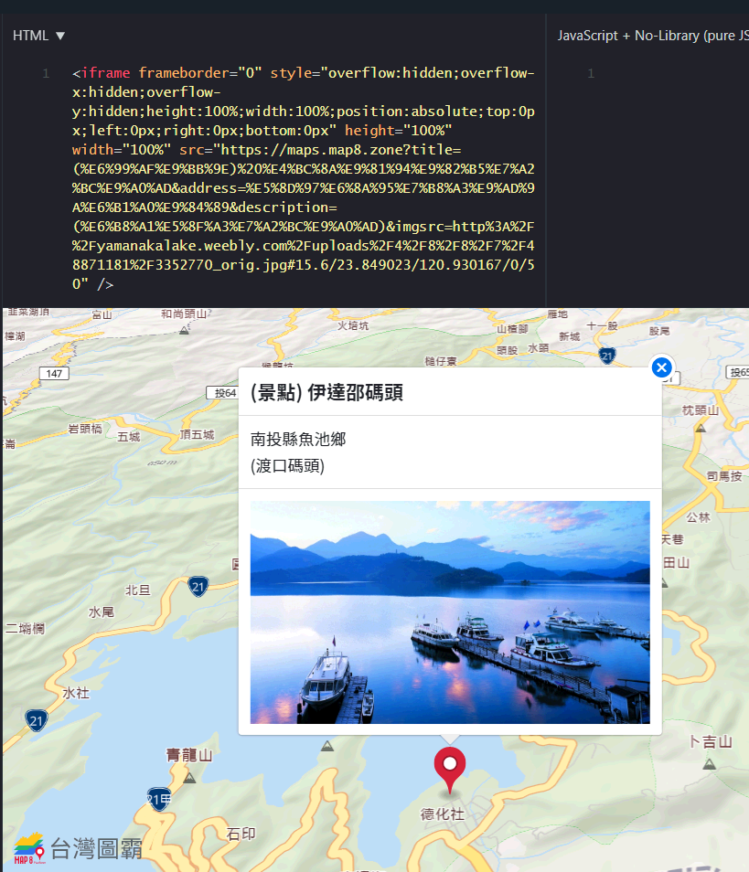
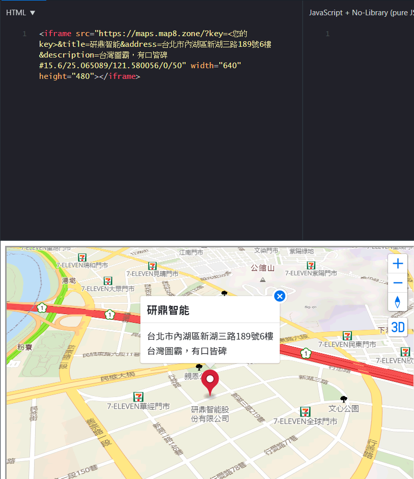
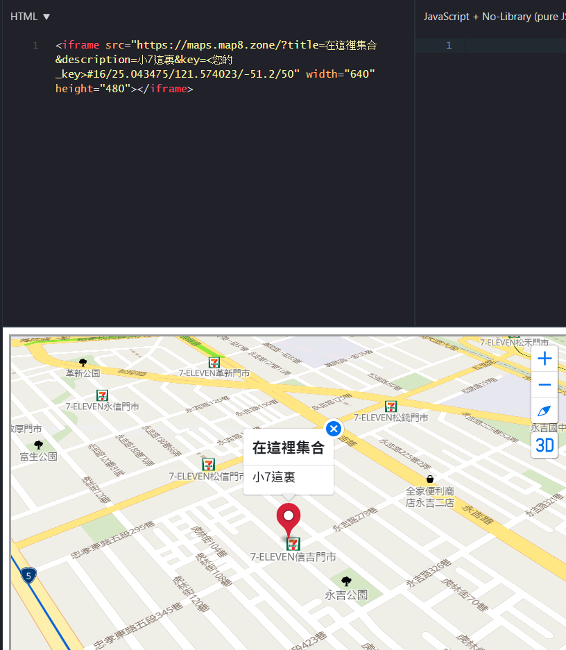

# 台灣圖霸電子地圖 API 平台 | Map8 Platform
# Application Programming Interface Specification
歡迎使用 ** 台灣圖霸電子地圖 API 平台 | Map8 Platform**

> Authentication、Notation 與 Version 請參見 [README](../../README.md)。線上版文件 : https://www.map8.zone/map8-api-docs/#maps

## Version
- v3.1_2025-09-19 (the present document)

## [Maps] 嵌入動態地圖
功能 : 在您的網站中嵌入互動地圖

## API Index
- [Maps Embed API (在您的網頁中嵌入一個互動地圖)](#maps-embed-api)

### Maps Embed API
讓您在網站或其他任何素材中嵌入互動地圖

- **API** :

    ```
    https://maps.map8.zone/?<標記說明參數>#<座標視角參數>
    ```
- **HTTP Method** :
    - **GET**
- **Synopsis**
    - **<標記說明參數>** :
        - 底下參數，用來讓您在地圖標記暨彈出視窗 (marker / popup) 上自訂您想要顯示的訊息。
        - **key**
            - 必要參數，請帶進您的 key。
        - **title**
            - 選擇性參數，欲顯示之標題 (格式為任意純文字)。
        - **address**
            - 選擇性參數，欲顯示之地址 (格式為任意純文字)。
        - **imgsrc**
            - 選擇性參數，欲顯示之圖片 (格式為圖片之 URL)。
        - **description**
            - 選擇性參數，欲顯示之附加說明 (格式為任意純文字)。
    - **<座標視角參數>** :
        - 底下這些井字符號 `#` 後綴的參數，用來讓您控制台灣圖霸電子地圖 API 平台所顯示地圖的中心點、比例尺層級、視角等等。格式為 `#` 後綴 `<縮放層級>/<緯度>/<經度>/<角度>/<視角>`。
        - 這些井字符號 `#` 後綴的參數，無須代入參數名稱，直接給值 (因而是有順序性的，請務必依照順序，以使地圖能如您預期作動)。
        - **縮放層級**
            - 必要參數，數值 1~20 (數值小為小比例尺，數值越大則比例尺越大；譬如 10 可以看到整個中台灣，而 19 則已經是特寫部分街廓)
                - (您可以從我們線上地圖平台 https://maps.map8.zone 的網址列井字號 `#` 後面的第一個數字評估此數值)。
        - **緯度**
            - 必要參數，WGS84 / EPSG:4326 之緯度。
        - **經度**
            - 必要參數，WGS84 / EPSG:4326 之經度。
        - **角度**
            - 選擇性參數，數值 -180~180，單位：度。為地圖的哪個方位朝上 (譬如, 0 表示地圖正北朝上)。
        - **視角**
            - 選擇性參數，數值 0~60，單位：度。為俯視地圖的角度 (譬如, 0 表示從正上方俯瞰地圖，而 60 表示以與地平面夾 30 度角的方式俯瞰地圖)。
    - **直接利用智慧搜尋功能** :
        - 若地理座標參數 **緯度**、**經度** 未給，而 **title** 或 **address** 有給，則台灣圖霸電子地圖 API 平台將以 **title** 與 **address** 直接進行智慧搜尋來顯示您的地標。
- **Request Message Body** :
    - N / A.
- **Response** :
    - N / A.
- **Example**
    - 請於瀏覽器直接打開 :

        ```
        https://maps.map8.zone/?key=<您的 key>&title=圖霸科技&address=台北市內湖區港墘路200號4樓&description=台灣圖霸，有口皆碑#15.6/25.075904/121.574494
        ```
    - 或是加上 optional 的地圖視角 :

        ```
        https://maps.map8.zone/?key=<您的 key>&title=圖霸科技&address=台北市內湖區港墘路200號4樓&description=台灣圖霸，有口皆碑#15.6/25.075904/121.574494/0/50
        ```
    - 您也可以使用 iframe 方式來將台灣圖霸電子地圖 API 平台的地圖嵌入您的網站 -- 如下示範，只要將上述網址格式直接填入底下 `<iframe>` 標籤內的 src 欄位即可 :

        ```html
        <iframe src="https://maps.map8.zone/?key=<您的 key>&title=圖霸科技&address=台北市內湖區港墘路200號4樓&description=台灣圖霸，有口皆碑#15.6/25.075904/121.574494/0/50" width="640" height="480">使用 <a href="https://www.map8.zone">台灣圖霸電子地圖 API 平台</a> 顯示 <a href="https://maps.map8.zone/?&title=圖霸科技&address=台北市內湖區港墘路200號4樓&description=台灣圖霸，有口皆碑#15.6/25.075904/121.574494/0/50">地圖 (台灣圖霸電子地圖 API 平台 Map8 Platform https://www.map8.zone)</a></iframe>
        ```

        
    - 如下圖是 `https://maps.map8.zone/?title=圖霸科技&address=台北市內湖區港墘路200號4樓&description=台灣圖霸，有口皆碑&key=<您的 key>#15.6/25.075904/121.574494/0/50`

        
    - 或是更簡單點 : `https://maps.map8.zone/?title=圖霸科技&address=台北市內湖區&key=<您的 key>`，一樣可以獲得同上述的效果
    - 如下圖是 `https://maps.map8.zone/?title=在這裡集合&description=小7這裏&key=<您的 key>#16/25.043475/121.574023/-51.2/50`

        

- [back to index](#api-index)

----

<p align="center">
<a href="https://map8.zone"></a> <br/> https://map8.zone
</p>
