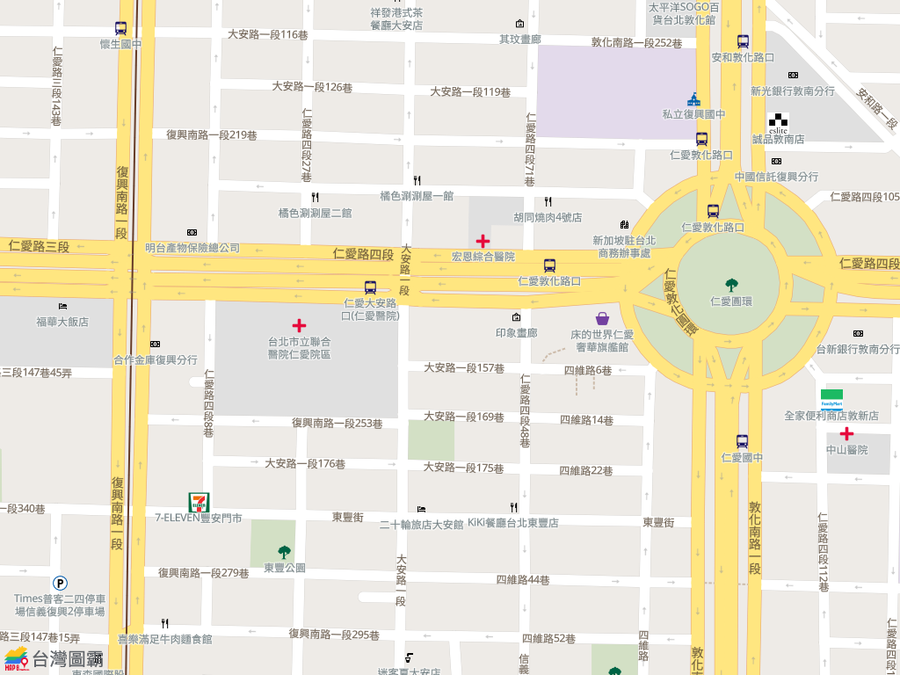

# 台灣圖霸電子地圖 API 平台 | Map8 Platform
# Application Programming Interface Specification
歡迎使用 ** 台灣圖霸電子地圖 API 平台 | Map8 Platform**

> Authentication、Notation 與 Version 請參見 [README](../../README.md)。線上版文件 : https://www.map8.zone/map8-api-docs/#maps-2

## Version
- v3.1_2025-09-19 (the present document)

## [Maps] 地圖靜態圖片
功能 : 在您的網站中嵌入靜態地圖 (圖片)

## API Index
- [Maps Static API (製作顯示地圖的圖檔)](#maps-static-api)

### Maps Static API
製作顯示地圖的圖檔，讓您在網站或其他任何素材中嵌入靜態地圖

- **API** :

    ```
    https://api.map8.zone/maps/staticmap?<參數>
    ```
- **HTTP Method** :
    - **GET**
- **Synopsis**
    - **<參數>**
        - **key**
            - 必要參數，請帶進您的 key。
        - **center**
            - 必要參數，欲製作成圖片的地圖中心點 (將與圖片四周等距離)，格式為 `<緯度>,<經度>`。
        - **zoom**
            - 必要參數，整數，代表欲製作成圖片的地圖縮放層級 (比例尺)。
            - (數值小為小比例尺，數值越大則比例尺越大；譬如 10 可以看到整個中台灣，而 19 則已經是特寫部分街廓)。
            - (您可以從我們線上地圖平台 https://maps.map8.zone 的網址列井字號 `#` 後面的第一個數字評估此數值)。
        - **size**
            - 必要參數，欲製作的圖片寬高。格式為 `<寬>x<高>` (單位為 pixel)。
        - **format**
            - 選擇性參數，欲製作的圖片格式。可為 `png` 或 `jpg` 兩者之一。預設為 `png`。
    - **(Migration 指南) 與 Google Maps 的 Static API 相容性**
        1. **center** 參數僅支援 `<緯度>,<經度>` 格式，不支援 `地址`。
        2. 其他 [Google Maps Static API 的參數](https://developers.google.com/maps/documentation/maps-static/dev-guide#URL_Parameters) 包括 `scale`, `maptype`, `language`, `region`, `markers`, `path`, `visible`, `style` 均 ignore (因此，同樣地，您可自行決定要刪除或留著)。
- **Request Message Body** :
    - None.
- **Response**
    - Status code : **200** OK
        - 表示成功完成您的 request
        - **Response Message Body** :
            - 圖片本身
    - 參見 [HTTP Status Code](../appendix.md#http-status-code) 一節說明本 API 回傳值之一般通則
- **Example** (請於瀏覽器直接打開)

    ```
    https://api.map8.zone/maps/static?key=<您的 key>&center=25.03745,121.547428&zoom=17&size=1024x768&format=jpg
    ```

    

- [back to index](#api-index)

----

<p align="center">
<a href="https://map8.zone"></a> <br/> https://map8.zone
</p>
