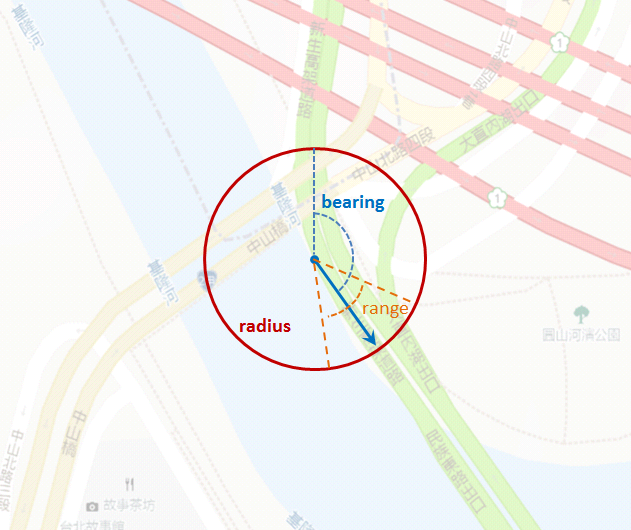

# 台灣圖霸電子地圖 API 平台 | Map8 Platform
# Application Programming Interface Specification
歡迎使用 ** 台灣圖霸電子地圖 API 平台 | Map8 Platform**

> Authentication、Notation 與 Version 請參見 [README](../../README.md)。線上版文件 : https://www.map8.zone/map8-api-docs/#api-nearest-roads-api

## Version
- v3.1_2025-09-19 (the present document)

## [Roads] 道路資訊
功能 : 取得道路屬性與黏路

## API Index
- [Nearest Roads API (道路屬性)](#nearest-roads-api)
- [Snap to Roads API (黏路)](./snap-to-roads-api.md)

### Nearest Roads API
對道路進行反定址 (也就是由輸入之地理座標轉為道路)，並獲取道路屬性 (速限、高架、橋樑、限高)。

> 請留意 : URL 必須正確 [編碼](https://en.wikipedia.org/wiki/Percent-encoding)，並且所有 Map8 API 均限制在最多 8192 個字元。當您建立呼叫 Map8 API 的 URL 時，請務必留意到此限制。

- **API** :

    ```
    https://api.map8.zone/road/nearestRoads/<交通工具>?<參數>
    ```
- **HTTP Method** :
    - **GET**
- **Synopsis**
    - **交通工具**
        - 目前僅支援 `car` (汽車)。
    - **<參數>**
        - **key**
            - 必要參數，請帶進您的 key。
        - **latlng**
            - 欲取得之 `道路` 的 `經緯度` 座標 (格式為 `<緯度>,<經度>`)。
        - **additional_fields**
            - 指定欲額外索取之欄位，可為 :

                | 值 | 意義 |
                |---|---|
                | `speed` | 道路速限 (KPH) |
                | `height` | 道路限高 (公尺) |
                | `elevated` | 若道路為高架，傳回 `1`，平面傳回 `0`，地下道傳回 `-1` |
                | `bridge` | 若道路為橋，傳回橋名 |

            - 可指定多個欄位 -- 請以逗點分隔即可，例如 `&additional_fields=speed,elevated,height,bridge`。
        - **進階參數** :
            - 底下進階選項 (選擇性參數) 可以用來讓您指定更多的定位條件，以取得更優良的定位結果。
            - **bearing**
                - 指明座標 (`latlng` 參數) 所伴隨之行進方向。為與正北 (true north) 的夾角。範圍為 0 ~ 360 (i.e., 單位為 degree)。
            - **range**
                - 指定上述角度 (`bearing` 參數) 的容許偏差範圍。合法數值為 0 ~ 180 (i.e., 單位為 degree)。當此參數被指定時，`bearing` 參數也應被指定。
            - **radius**
                - 對 `道路` 進行反定址時所容許的距離範圍。一般應為於實際位置進行 GPS 定位 `經緯度` 座標時所獲得的誤差值。單位為公尺 (meter; m)。
                - (以手機而言，您可以考慮使用 Android 的 `Location.getAccuracy()` 或是 iOS 的 `CLLocation.horizontalAccuracy`。)
            - 以上參數如圖解 :

                

            - 舉例 : 下方範例之地點，為中山高速公路 (東西向) 與大直橋 (南北向) 之複雜立體交叉路口。藉由指定上述參數 (下例指定為北方偏東 2 度，允許定位誤差為 ±1.5 度)，即可獲得所希望的結果 :

                > 您甚至可以藉由操作這些參數，精準定位順向或反向的道路。

                ```
                HTTP GET "https://api.map8.zone/road/nearestRoads/car?key=<您的 key>&latlng=25.073448,121.544539&additional_fields=speed,elevated,height,bridge&bearing=2&range=3"
                ```
                ```json
                {
                  "html_attribution": ["台灣圖霸", "研鼎智能", "PAPAGO!"],
                  "results": [
                    {
                      "formatted_address": "台北市中山區 - 大直橋明水路方向",
                      "id": "",
                      "place_id": "",
                      "name": "大直橋明水路方向",
                      "city": "台北市",
                      "town": "中山區",
                      "type": "道路",
                      "distance": 10.19,
                      "speed": "50",
                      "elevated": "1",
                      "height": "",
                      "bridge": "大直橋明水路方向"
                    }
                  ],
                  "status": "OK"
                }
                ```
- **Request Message Body** : None.
- **Response**
    - Status code : **200** OK
        - 表示成功完成您的 request
        - **Response Message Body**
            - Content-type: application/json

            ```
            {
              "html_attributions" : [                  // 您必須向使用者表彰之本 API 所屬的圖資版權資訊
                "台灣圖霸",
                "研鼎智能",
                "PAPAGO!"
              ],
              "results" : [                            // `搜尋結果` 陣列
                {
                  "formatted_address" : <String>,    // 地址 (經整理、格式化過的)
                  "id" : <String>,                   // 此地點於台灣圖霸電子地圖 API 平台內的地點 ID
                  "place_id" : <String>,             // 此地點於台灣圖霸電子地圖 API 平台內的地點 ID
                  "name" : <String>,                 // 本筆資料的名稱 (地名、道路名、地點名)
                  "city" : <String>,                 // 本筆資料所屬的城市 (例如 "台北市")
                  "town" : <String>,                 // 本筆資料所屬的行政區 (例如 "內湖區")
                  "type" : <String>,                 // 本筆資料的類型，為 "道路"
                  "speed" : <String>,                // 本筆資料之道路速限 (KPH)
                  "height" : <String>,               // 本筆資料之道路限高 (公尺)
                  "elevated" : <String>,             // 本筆資料之道路若為高架，傳回 `1`，平面傳回 `0`，地下道傳回 `-1`
                  "bridge" : <String>,               // 本筆資料之道路若為橋，傳回橋名
                }
              ],
              "status" : <String>  // Status Code
            }
            ```
            - 上述每一筆搜尋結果內的各欄位, 若無值, 仍一律回傳, 但帶空值
    - Status code : **400** Bad Request
        - 表示您的 request 系統偵測到有錯誤而無法完成您的要求。通常是給入的參數多了或少了，或是格式有錯誤，或必要參數卻沒給，等等
        - **Response Message Body**
            - Content-type: application/json

            ```
            {
              "status" : <String>     // Status Code
            }
            ```
    - 參見 [HTTP Status Code](../appendix.md#http-status-code) 一節說明本 API 回傳值之一般通則
    - 參見 ["status" 欄位](../appendix.md#status-欄位) 一節說明 "status" 欄位的一般性意義

- **Example** : 此例以 `car` (汽車) 作為交通工具

    ```
    HTTP GET "https://api.map8.zone/road/nearestRoads/car?key=<您的 key>&latlng=25.073448,121.544539&additional_fields=speed,elevated,height,bridge"
    ```
    ```json
    {
      "html_attribution": ["台灣圖霸", "研鼎智能", "PAPAGO!"],
      "results": [
        {
          "formatted_address": "台北市中山區 - 中山高汐五高架道路",
          "id": "",
          "place_id": "",
          "name": "中山高汐五高架道路",
          "city": "台北市",
          "town": "中山區",
          "type": "道路",
          "distance": 5.10,
          "speed": "100",
          "elevated": "1",
          "height": "",
          "bridge": ""
        }
      ],
      "status": "OK"
    }
    ```

- [back to index](#api-index)

----

<p align="center">
<a href="https://map8.zone"></a> <br/> https://map8.zone
</p>
